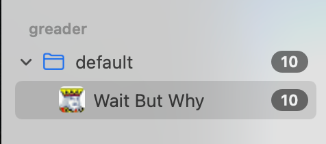

# greader

RSS service, providing api similar to google reader.

## Install

```bash
go install github.com/chyroc/greader@latest
```

## Usage

### Start Service

```go
GREADER_DSN=xx ./greader
```

### RSS API

```text
http://<address>:8082/api/greader
```



## Ref

- https://ranchero.com/downloads/GoogleReaderAPI-2009.pdf
- https://github.com/Ranchero-Software/NetNewsWire/blob/mac-6.1.1b1/Account/Sources/Account/ReaderAPI/ReaderAPICaller.swift
- https://github.com/FreshRSS/FreshRSS/blob/1.20.2/p/api/greader.php
